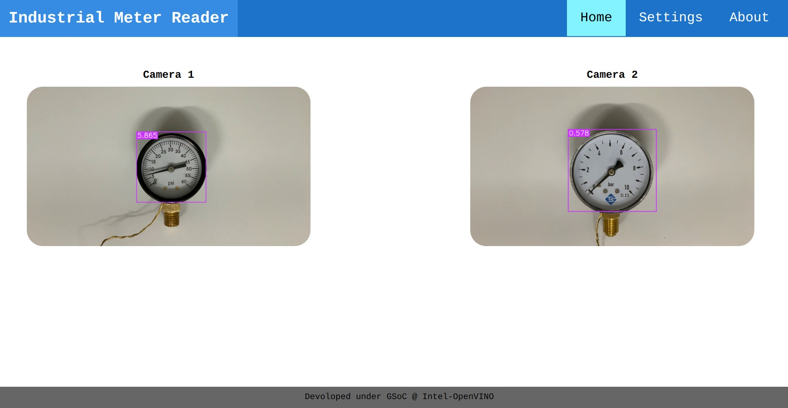
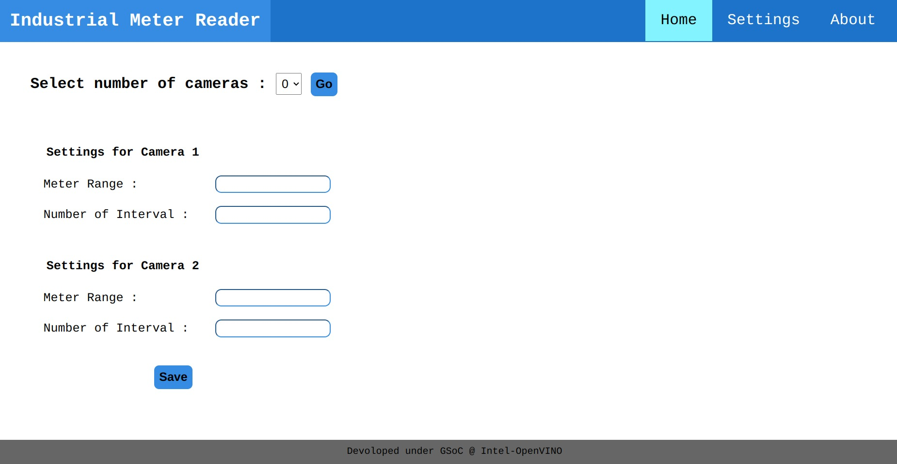

# Industrial Meter Reading WebApp with Optimized-pipeline

The aim is to optimized pipeline for multi-camera support and to create a user friendlt web-based GUI.

## Optimization

### Asynchronous Inference with OpenVINO™

OpenVINO Runtime supports inference in either synchronous or asynchronous mode. The key advantage of the Async API is that when a device is busy with inference, the application can perform other tasks in parallel (for example, populating inputs or scheduling other requests) rather than wait for the current inference to complete first.

for more detailed implimentation checkout [optimization-wiki](https://github.com/ashish-2005/GSoC23-OpenVINO/wiki/Optimization) or [app.py](app.py) file.

## WebApp

When it comes to backend for a website, flask and django truns out to be the best choise because of their flexibility, features, easy implementation and immense amount of support available. For this project we went with flask as its relatively simpler and lighter than django.

For frontend we used HTML and CSS, and used JavaScript to make it more user-friendly and add some important functionality along with to act like a bridge and process backend generated data.

### Home page

### Settings page
